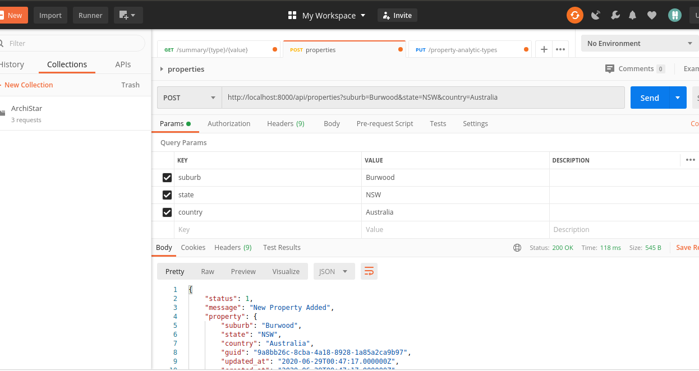
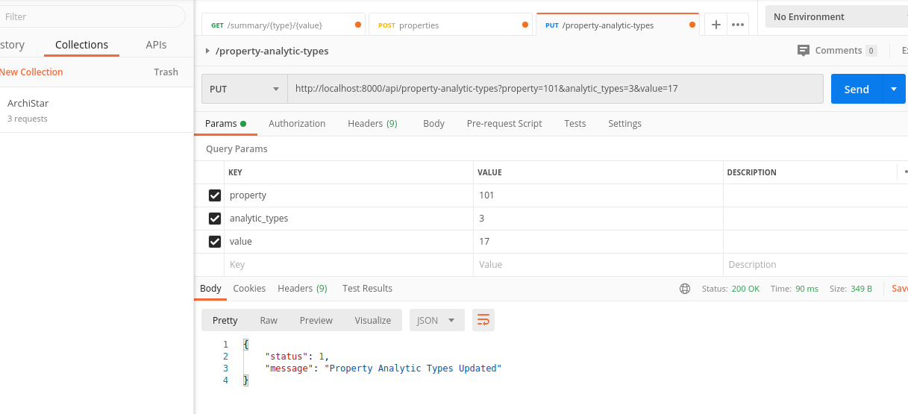
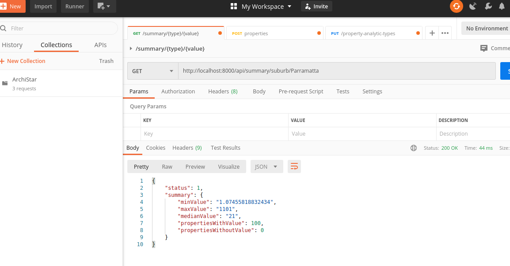
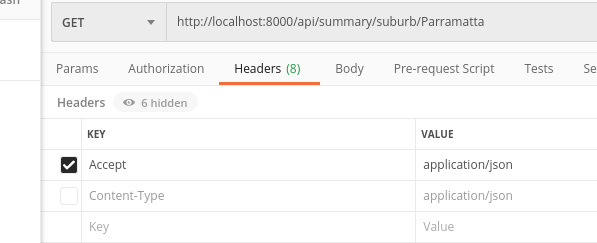

## Property API - Build With Laravel

Instructions: To set up locally or deploy this API.

- Clone This Project from following git repository on github.
    
        - git clone  https://github.com/suduval/laravelProject.git
        
        - cd laravelProject
        
        - composer install
        
        - ./vendor/bin/phpunit (will run tests no need db)
        
        - edit .env and put your db credentials
        
        - php artisan migrate:refresh --seed
  
  
Now run the Laravel artisan as below

  to run 
  
    - php artisan serve

You can access the api from http://localhost:8000
Please remember to change the APP_URL to above before run tests.

* Api Endpoints

    - POST - /properties
    
      params ['suburb', 'state', 'country']
      
      
      
    - PUT - /property-analytic-types
        
         params ['property', 'analytic_types', 'value']
         
         
         
    - GET - /summary/{type}/{value} (e.g. /summary/suburb/Parramatta)
       
        type ? suburb | state | country
        
        

** Note: Please add following header to your requests when you are accessing above endpoints using Postman or any other application

  - 'Accept: application/json'
  
  

